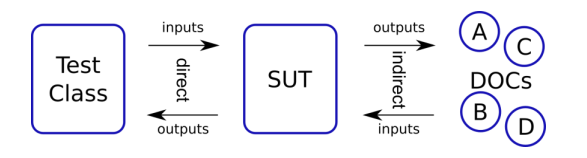

# Actividad 1 Testing

1. Explica el siguiente gráfico en términos de SUT y DOC para pruebas unitarias



El grafico representa la interaccion entre la **Clase de Prueba** y el **SUT** (Sistema bajo Prueba) en el contexto de las pruebas unitarias, asi como la relacion del **SUT** con los **DOCs (Componentes Dependientes).**

- La Clase de Prueba es la contiene los casos de prueba y envia **inputs directos** al SUT para evaluar su comportamiento.
- El SUT es el componente del sistema que estamos probando directamente por la clase **Test;** recibe los **inputs directos** y devuelve **outputs directos** que la clase Test utiliza para verificar si el SUT funciona como se espera.
- Los DOCs son los componentes externos del SUT que pueden afectar o ser afectados por **inputs o outputs indirectos** por lo que se gestiona las dependencias  para asegurar que las pruebas sean aisladas y especificas.

1. Imaginemos algún servicio financiero (clase FinancialService) que, en función del último pago del cliente y su tipo (cualquiera que sea), calcula algún "bonus"

```java
public class FinancialService {
	.... // definition of fields and other methods omitted
	public BigDecimal calculateBonus(long clientId, BigDecimal payment) {
		Short clientType = clientDAO.getClientType(clientId);
		BigDecimal bonus = calculator.calculateBonus(clientType, payment);
		clientDAO.saveBonusHistory(clientId, bonus);
		return bonus;
 }
}
```

Identifica el SUT y sus colaboradores (DOC) y describe los tipos de interacción que ocurren
dentro del método calculateBonus() importantes para la prueba.

El SUT en este contexto es el metodo `calculateBonus()` ya que este es el responsable de calcular el bonus basado en el tipo de cliente y el ultimo pago.

Los DOCs serian los objetos `clientDAO` y `calculator`.

- `clientDAO`: Es un objeto que maneja la interaccion con la capa de acceso a datos para obtener y almacenar la informacion sobre el cliente
- `calculator`: Es un objeto que contiene la logica para calcular el bono.

Las interacciones son:
Input indirecto: `clientDAO.getClientType(clientId)`,`clientDAO.saveBonusHistory(clientId, bonus)`

Output indirecto:  `calculator.calculateBonus(clientType, payment)`

1. Sea la abstraccion POO siguiente:


¿Como crees que serían las pruebas de los trabajos y la de los gerentes? ¿Por qué preocuparse por las interacciones indirectas?

La abstraccion suguiere una jerarquia de roles donde los `trabajadores` son supervisados por los `gerentes`, y ambos interactuan con un cliente. Las pruebas para trabajadores y gerentes se enfocaran en validar que sus interacciones y responsabilidades se ejecuten correctamente.

Pruebas para Trabajadores:

- Funcionalidad: Verificar que completan las tareas asignadas adecuadamente
- Interaccion: Asegurar que reportan el progreso y problemas a los gerentes.

Pruebas para Gerentes:

- Delegacion: Confirmar que asignan tareas eficientemente a los trabajadores
- Supervicion: Evaluar que monitorean el desempeño de los trabajadores y gestionan los recursos.

Razones por las cuales debemos preocuparnos por las interacciones indirectas

- Dependencias: Pueden existir dependencias ocultas que afecten el flujo de trabajo
- Efectos Colaterales: Cambios en un area puede tener impactos inesperados en otras.
- Efecto Cascada: Un error en un nivel bajo puede propagarse a traves de interacciones indirectas y hacer mas grande los errores en niveles altos.
1. Completa en la actividad dada en el repositorio el código fuente para pasar las pruebas.


1. ¿Cuál es la diferencia entre una prueba unitaria y otros tipos de pruebas, como las pruebas de
integración o las pruebas de aceptación?

Las pruebas unitarias se centran en probar unidades individuales de codigo, las pruebas de integracion se centran en verificar la interaccion entre diferentes partes del sistema, y las pruebas de aceptacion se centran en validar que el sistema cumpla con los requisitos y expectativas del usuario final.