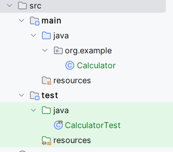

# Actividad 3 AAA

Autor: Andrei Steven Trujillo Armas 

---

En esta actividad vamos a crear un ejemplo de tarea que implica escribir pruebas unitarias siguiendo el patrón AAA para una clase `Calculador` simple. Esta clase tendrá métodos para realizar operaciones básicas de matemáticas como sumar, restar, multiplicar y dividir.

Escribiremos pruebas unitarias para cada uno de estos métodos usando JUnit 5, aplicando el patrón AAA.

---

### Paso 1: Creacion de la Clase Calculator

Se implemento la clase `Calculator` y la clase `CalcualtorTest`

Creamos pruebas unitarias para los metodos de la clase `Calculator` cuyos metodos son suma,resta,multiplicacion y division tomando en cuenta casos exclusivos como la division entre 0.

Hacemos uso de las excepciones para casos cuando un numero sea dividido entre 0.

Ahora realizaremos las pruebas unitarias.

###