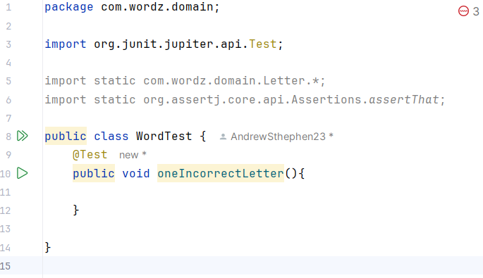

# Actividad TDD2

1. Escribimos el siguiente codigo para comenzar nuestra prueba

1. Para empezar decidi usar una clase llamada Word para representar nuestra palabra. También decidi proporcionar la palabra a adivinar como un parámetro de construcción para nuestra instancia de objeto de la clase Word que queremos crear. 
    
    Esto lo llevaremos a Codigo para el diseño de la prueba:
    
    
    
2. Ahora vamos a renombrar el parametro que va en el constructor de Word
    
    
    
3. Regresamos a la prueba para capturar el nuevo objeto como una variable para que lo podamos probar:
    
    
    
4. Crearemos un metodo llamado guess() para pasar la adivinacion.
    
    
    
    
    
5. Ahora agregaremos la forma de obtener la puntuacion de esa suposicion. Comenzamos con la prueba.
    
    
    
6. Ahora si ejecutamos la prueba esta va a fallar por lo que tendremos que ver donde es el error y refactorizar.

1. Como ya nos dice el error hagamos que la prueba pase agregando codigo a la clase Word.

1. Ahora veamos si las prueba logra pasar 

1. Ahora exportamos el test en HTML

