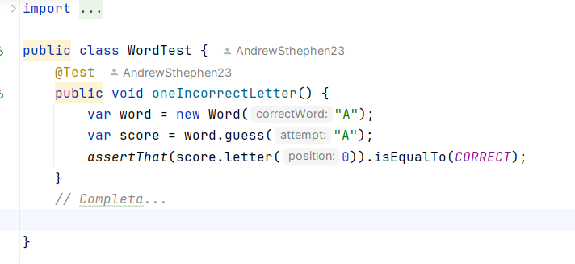

# Actividad TDD3

---

Esta actividad consta de 3 ciclos TDD donde cada ciclo se incluira pruebas las cuales siguien el siguiente patron:

rojo → verder → azul

- rojo: pruebas que fallan
- verde: pruebas que pasan
- azul: la refactorizacion

# 1° Ciclo TDD

1. Primero vamos a empezar en rojo. Escribiremos una prueba fallida para una sola letra correcta:

**Pregunta: Explica que hace esta prueba**. 

Esta prueba va a verificar la funcionalidad del método **`guess()`** de la clase **`Word`** al confirmar si la letra ingresada coincide correctamente con la letra presente en la palabra representada por el objeto **`Word`**. En este caso la prueba no sera valida ya que cuando se adivina la letra 'B' en una palabra de una sola letra ('A'), el resultado indicará que la letra adivinada es incorrecta.

1. Ahora pasaremos a **verde**  para eso agregaremos el codigo de produccion para que pase la prueba :

Usamos el IDE para ayudarnos a escribir la clase Score:

- Para cubrir el nuevo comportamiento probado por la prueba oneCorrectLetter(), agregamos el código anterior. En lugar de que el método `**assess()**` siempre devuelva Letter.INCORRECT como lo hizo anteriormente, la nueva prueba ha forzado una nueva dirección. El método **`assess()`** ahora debe poder devolver el puntaje correcto cuando una letra adivinada es correcta.
- Para lograr esto, agregamos un campo llamado resultado para contener el último puntaje, código para devolver ese resultado del método **`letter()`** y código en el método **`assess()`** para verificar si la primera letra de la adivinación coincide con la primera letra de la palabra Si lo hemos hecho bien, ambas pruebas deberían pasar ahora.

**Pregunta: Ejecuta todas las pruebas para ver cómo lo estamos haciendo. ¿Qué encuentras aquí?.**

Podemos observar que el test paso correctamente 

## Definicion de olores de codigo

El término olor a código apareció originalmente en la wiki de C2. Vale la pena leer para ver los ejemplos de olores de código.Tiene una definición útil que señala que el olor del código es algo que necesita revisión, pero que no necesariamente debe cambiarse: [https://wiki.c2.com/?CodeSmell](https://wiki.c2.com/?CodeSmell). Reflexionemos sobre el interior del método **`assess()`**. Simplemente parece desordenado con demasiado código. Extraemos un método auxiliar para agregar algo de claridad. Siempre podemos revertir el cambio si sentimos que no ayuda.

1. Ahora vamos a refactorizar “**azul”.** Extraemos un metodo issCorrectLetter() para mayor claridad:

Vamos a ejecutar la prueba para ver que la refactorizacion no ha malogrado nada. Las pruebas pasan “**verde**”

Hay dos áreas más que quiero refactorizar en esta etapa. El primero es un método simple para mejorar la legibilidad de la prueba. Refactoricemos el código de prueba para mejorar su claridad. Agregaremos un método de assert personalizado:

La próxima refactorización que quizás queramos hacer es un poco más controvertida, ya que es un cambio de diseño. Hagamos la refactorización. ¿Estas de acuerdo con ese ‘cambio’?

1. Cambiemos cómo especificamos la posición de la letra para verificar en el método **`assess()`**

# 2°Ciclo TDD

## **Avanzando en el diseño con combinaciones de dos letras**

1. Comencemos escribiendo una prueba para una segunda letra que está en la posición incorrecta(**`ROJO`**):

La prueba falla 

1. Agreguemos el código inicial para verificar todas las letras en nuestra adivinación:

1.  Agreguemos código para detectar cuándo una letra correcta está en la posición incorrecta:

La prueba paso!! “verde”

# 3°Ciclo TDD:

## **Prueba para evaluar el comportamiento en torno a la segunda letra en la posición incorrecta.**

1. Agrega una nueva prueba ejercitando las tres posibilidades de puntuació (**`rojo`**)

Ejecutamos la prueba:

La prueba fallo! (rojo)

1. Agrega una lista List de resultados para almacenar el resultado de cada posición de letra por separado:

Ejecutamos la prueba, y la pasa (**verde**)

1. Extraigamos la lógica dentro del cuerpo del ciclo en un método scoreFor():**`(AZUL)`**

El codigo anterior se lee mucho más claramente. El cuerpo del método scoreFor() es ahora una descripción concisa de las reglas para puntuar cada letra. Reemplazamos la construcción if-else-if con una construcción if-return más simple. Averiguamos cuál es el puntaje, luego salimos del método inmediatamente.

1. El siguiente trabajo es limpiar el código de prueba **`(AZUL)`**

Finalmente de esta forma queda nuestro codigo de pruebas

 

Ahora exportamos las pruebas en HTML

