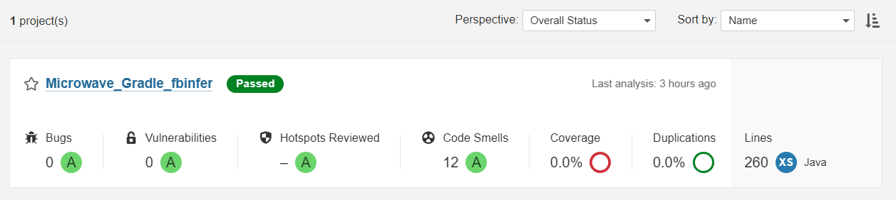

# Actividad 7 Codigo Estatico

Autor: Andrei Steven Trujillo Armas 

---

En esta actividad se vera el uso de sonarqube para el analisis estatico de codigo.

Para iniciar la actividad primero tenemos que entrar al proyecto de sonarqube que esta conectado con nuestro IDE para poder ver el reporte que nos da.

En el reporte nos dara la cantidad de ***Code Smells,*** el objetivo es reducir estos mismos para poder tener un codigo con mayor calidad.

---

## Reporte Inicial de Sonarqube

---

## Refactorizacion

Para la refactorizacion nos vamos a concentrar en arreglar los que tienen un estado **Critical** o **Mayor.**

### 1. Primer olor de codigo

Nos inidica que el metodo tiene una complejidad cognitiva muy alta por lo cual refactorizaremos para que disminuya la complejidad.

 El Metodo `tick`  actualiza el display en funcion del modo actual del microondas. 

Para la refactorizacion crearemos metodos privados para setUp y cooking para que el nivel de complejidad del metodo disminuya.

Ahora comprobaremos si la refactorizacion afecto el comportamiento que se espera de la clase para lo cual ejecutaremos las pruebas.

### 2. Segundo olor de codigo

Como se puede apreciar en la siguiente imagen sonarqube nos da una posible solucion 

Para refactorizar este olor de codigo crearemos un `enum` fuera de la clase `ModeController`

Ahora comprobemos si los test siguen pasando.

### 3. Tercer olor de codigo

Sonarqube nos dice que el primer argumento debe ser el valor esperado y el segundo el valor actual, sin embargo aqui estan en orden distinto, por lo que deben cambiarse.

 Ahora veremos si pasa las pruebas

---

Ahora haremos un nuevo reporte, para poder determinar cuantos olores de codigo logramos reducir.

Como se puede apreciar se ha reducido los olores de codigo de 12 a 4, por lo que tenemos un codigo de mayor calidad.