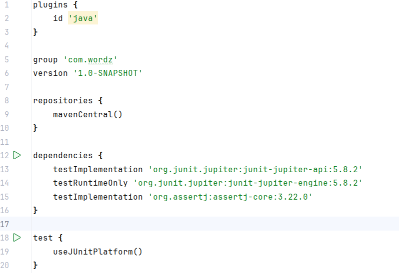

# Examen Parcial

# Sprint 1

Autor: Andrei Steven Trujillo Armas

---

1. Configuramos el entorno 

ponemos las dependencias para usar Junit5

1. Empezamos con el primer ciclo de TDD 

Primero vamos a empezar en rojo. Escribiremos una prueba fallida para una sola letra correcta:

Esta prueba va a verificar la funcionalidad del método **`guess()`** de la clase **`Word`** al confirmar si la letra ingresada coincide correctamente con la letra presente en la palabra representada por el objeto **`Word`**. 

Entonces decimos que la prueba valída cuando se adivina la letra 'Z' en una palabra de una sola letra ('A'), el resultado indicará que la letra adivinada es incorrecta.

1. Ahora pasaremos a **verde**  para eso agregaremos el codigo de produccion para que pase la prueba :

Usamos el IDE para ayudarnos a escribir la clase Score:

- Para cubrir el nuevo comportamiento probado por la prueba oneCorrectLetter(), agregamos el código anterior. En lugar de que el método `**assess()**` siempre devuelva Letter.INCORRECT como lo hizo anteriormente, la nueva prueba ha forzado una nueva dirección. El método **`assess()`** ahora debe poder devolver el puntaje correcto cuando una letra adivinada es correcta.
- Para lograr esto, agregamos un campo llamado resultado para contener el último puntaje, código para devolver ese resultado del método **`letter()`** y código en el método **`assess()`** para verificar si la primera letra de la adivinación coincide con la primera letra de la palabra Si lo hemos hecho bien, ambas pruebas deberían pasar ahora.

Ejecutamos todas las pruebas para ver cómo lo estamos haciendo

1. Haremos un analisis Estatico

Reflexionemos sobre el interior del método **`assess()`**. Simplemente parece desordenado con demasiado código. Extraemos un método auxiliar para agregar algo de claridad. Siempre podemos revertir el cambio si sentimos que no ayuda.

1. Ahora vamos a refactorizar “**azul”.** Extraemos un metodo isCorrectLetter() para mayor claridad:
    
    
    
    Vamos a ejecutar la prueba para ver que la refactorizacion no ha malogrado nada. Las pruebas pasan “**verde**”
    
    
    
    1. Ahora crearemos la prueba OneCorrectLetter 
    
    
    
    Ejecutamos la prueba :
    
    
    
    1. Hay dos áreas más que quiero refactorizar en esta etapa. El primero es un método simple para mejorar la legibilidad de la prueba. Refactoricemos el código de prueba para mejorar su claridad. Agregaremos un método de assert personalizado:
    
    
    
    Podemos ver que ahora llamamos directamente a ese assertion personalizado y todo es mas entendible.
    
    
    

La próxima refactorización que quizás queramos hacer es un poco más controvertida, ya que es un cambio de diseño. Hagamos la refactorización

1. Cambiemos cómo especificamos la posición de la letra para verificar en el método **`assess()`**

Ejecutamos los test para ver que no hemos rota nada

