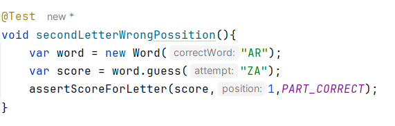

# Examen Parcial

# Sprint 2

Autor: Andrei Steven Trujillo Armas

---

1. Comencemos escribiendo una prueba para una segunda letra que está en la posición incorrecta(**`ROJO`**):

La prueba falla 

1. Agregamos el código inicial para verificar todas las letras en nuestra adivinación:

1. Agreguemos código para detectar cuándo una letra correcta está en la posición incorrecta:

La prueba paso!! “verde”

